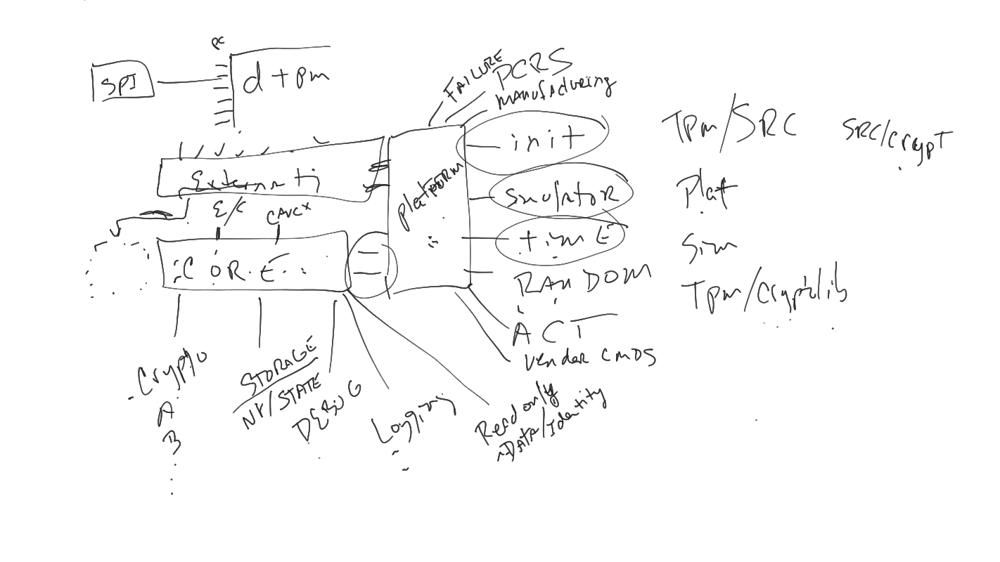
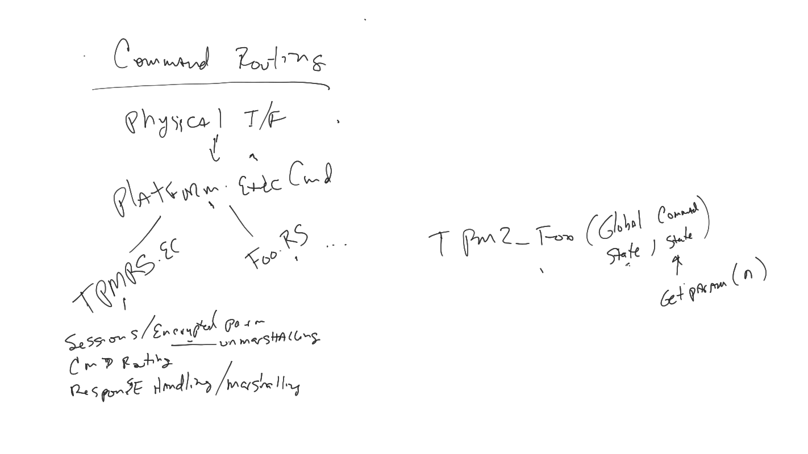

*   Introductions
*   Getting github access to tpm-rs if needed
    *   Send Github USERNAME to bradlitterell@
*   Gather participation Level and sub-domain interest (e.g. server vs client).
    *   HW Sec Google interested in server side implementation for nostd env. We
        plan on being able to contribute to implementation in 2024
    *   Emily can contribute to the client side. Providing we can use rust to
        talk to TPM (in production).
    *   Alyssa is interested in unsafe reviews, marshaling, and size
        optimization.
    *   Google Crypta team is interested in server side implementation and
        interested in contributing as well.
    *   Microsoft cannot officially staff development, but there is general
        excitement and people may use their extra time to help out.
    *   Huawei interested in contributing with implementation and reviews
    *   Infineon interested and may be able to contribute in the future
*   What are the requirements to the reference implementation from different
    parties
    *   For HW Sec see [Tpm-rs Manifesto Draft](#tpm-rs-manifesto-draft) below
    *   Need to make the “manifesto” list more digestible:
        *   Break up into 1) Requirements, 2) Usecases , and 3) best practice
            code paradigms
*   Tpm-rs will only target the most recent public release of TPM spec, which is
    current spec version 164
*   Can we have CI to check all of the supported build paths
    *   Google would like to have bazel build as a github CI action
    *   Including embedded platforms
    *   Kor N from helped set up the CI pipeline for Caliptra
        (https://github.com/chipsalliance/caliptra-sw)
*   What do we want to accomplish today:
    *   Go over open github discussions:
        https://github.com/orgs/tpm-rs/discussions
    *   Where do we put future work items in github so others can take work?
    *   What is the process of becoming a code owner?
    *   Abstraction layer definitions (e.g. crypto)
    *   High level block diagram E2E
    *   Marshaling strategy
        *   How much copying allowed?
        *   Arena use?
        *   For requests/response and also for storage
    *   Github CI tier 1 builds — who is going to add
    *   What is the exact list to transition from private to public for tpm-rs
        repo
    *   Certification/Compliance strategy and timeline for codebase/project
    *   Testing strategy
*   Decided: Use github project for tracking work
    *   Project lists task we want to work on
    *   On weekly triage convert project line items issues when work is schedule
    *   Use discussion and issues
    *   Suggest using mermaid for diagrams
    *   Create doc repo. Closing style
        *   Use auto formatter
        *   Use clippy
    *   List of requirements shall include use-case examples.
*   Architectural diagram
    *   Defining interfaces is the way to define layers
    *   There is a proposal to save runtime state
        (https://github.com/orgs/tpm-rs/discussions/9) - it should be a layer in
        the arch diagram
    *   Versioning saved state structures
        (https://github.com/orgs/tpm-rs/discussions/10)
        *   Version-type indicator: I support these sizes
        *   More capable implementation shall be able to import state of the
            less capable implementation. Less capable implementation shall be
            able to use the state saved by a more capable version if it only
            used algorithms supported by less capable, and if not it should be
            able to detect incompatibility.
*   Template for commit message
    *   PR already contains links to the issue
    *   We want one-liner to be useful, not have “Merge from branch xxx” in the
        name
    *   Every commit **should** have an issue, but it’s not a **must**
*   Dealing with unsafe code
    *   Can we do ![forbid(unsafe\_code)] in the TPM core library? Yes.
        *   Start with “deny” because we already have unsafe in marshalling
            code.
        *   We want to refactor unsafe out of tpm-rs core, and get to the state
            we have “forbid” in the end.
*   E2E requests processing with block level diagrams with focus on abstraction
    interfaces.
    *   Block diagram 
        *   Core depends on the following traits:
            *   Crypto
                *   May different sub-traits that have specific focus (e.g.
                    Hash)
            *   Storage (may also include RAM storage)
            *   Debug (would only be enabled during debug builds)
            *   Logging (would be enabled in production)
            *   ReadOnlyData
                *   Would provide hardware provided identity, certificates, etc.
            *   Time
            *   Platform
                *   Initial Manufacturing
                *   TPM Failure callback (because no panics in Code)
                *   Access PCRS
                *   Extra Vendor Commands
    *   Command routing 
        *   `Platform.ExecuteCommand` defaults to calling
            `Service.ExecuteCommand`, but platform could override this to
            provide custom vendor command handling (for vendor command that do
            not need session processing etc.)
        *   For Vendor command that want to benefit from session processing, the
            Platform trait should provide a way for Service to forward requests.
            *   It would be beneficial if the function signature for each
                command processor was the same. We will have to figure out how
                to pass the parsed session object etc through this common
                interface.
*   What is the exact list to transition from private to public for tpm-rs repo?
    *   Transition from private repo to public should be after we reach critical
        mass with developer and CI flow
    *   The CI flow must fail if PR breaks one of our “rules” (we need to
        defined these rules as well)
    *   Have unit tests set up so new developers know how to do a unit test.
    *   Have the skeleton framework of traits and module for the system (e.g.
        core crate, traits for crypto, storage, debug, logging, time, platform,
        etc)
    *   Have Startup and GetRandom commands implemented with tests.
    *   Should we also wait until we flesh out NvMem access patterns?
        *   Yes
    *   Client and Service for tpm-rs should live in the same repo since it
        makes it much easier to share code.
    *   Add to readme that we reserve the right to completely refactor once make
        public
    *   Add a readme describing architecture and best practices
    *   All code owners enforcements are active
*   Github CI tier 1 compile builds
    *   Embedded target (RISC-V)
    *   Host target (linux AMD64)
    *   Builds should fail if rustfmt output does not match
    *   Running unit tests
    *   Clippy
    *   No panic enforcer enabled
    *   [Future Task] Compliance tests against service implementation
*   Naming
    *   Core is `Service`. Client is `Client`
    *   Rust types better follow TPM spec types, field names, and provide direct
        mapping. There is a difference between wire format and internal
        representation due to variable size fields and alignment, so
        marshalling/unmarshalling is needed.
    *   In structures, call out spec names like `/// <TPM_SPEC_NAME>`
*   Future meetings: have monthly cadence. 2 hour meeting

# Potential TPM-RS topic that were not covered

*   Code structure
*   Marshaling scheme
    *   Three broad schemes: full zerocopy (lazy dynamic indexing), hybrid (copy
        all primitives, point into request buffer for large objects like keys),
        always-copy (what the tpm C reference code does)
    *   Should we avoid copying large things? For request and response
    *   Endian swap before or after marshaling. How work with constants
    *   Tpm2B generic struct and value?
    *   Buffer management. Does TPM manage its own buffers (e.g. arenas, and
        volatile buffers)
*   Roadmap timeline
    *   Specifically how can hardware schedules tie in. Although full
        implementation likely won't be available before 2025.
*   Certification
    *   What plans/strategy are there for certification
    *   Which certifications are targeted? E.g. FIPS

# Tpm-rs Manifesto Draft

*   tpm-rs is not just reference, this is the code to use in production
    *   note: that applies to core. some code will have to be reference: crypto,
        platform, filesystem - see below
*   Code size matters
    *   no panics, no Location
    *   For dependency injections use generics not `&dyn Trait` to allow the
        compiler to optimize the entire codebase, which it may know for a
        particular Platform
        *   If you have >2 generic system dependencies, wrap in a `MyStructDeps`
            trait declaring each dependency as an associated type.
    *   Configuration through compile-time constants passed to the
        implementation from outside
    *   zero-copy as much as possible
        *   Use the
            [zerocopy](https://docs.rs/zerocopy/latest/zerocopy/index.html)
            library, which aims for no-panic and does checks on your structs to
            make sure they're compatible with zerocopy deserialization
        *   Re-interpret slice of bytes as a struct reference rather than manual
            indexing, avoids many bounds checks and is much easier to maintain.
        *   Try to align input data whenever possible. Aligned reads are always
            simpler than unaligned reads.
        *   If you know you need unaligned access, avoid `repr(packed)`, use
            `zerocopy::byteorder`
    *   no fmt, println!
*   Embedded limitations matter
    *   #![no\_std]
    *   no allocations
*   Implementations can be different
    *   don't expect platform goes through reset when TPM logic goes through
        reset
    *   don't use static vars, don't rely in state being magically cleared
    *   no panics, no longjmp
    *   unrecoverable fail should be a platform-specific handler (which can
        reset the chip or just the TPM app/logic or do something else), not a
        panic
    *   Architecture should be modular: crypto impl, storage impl, logging,
        access to physical presence etc are platform-specific; platforms may
        need to do custom stuff on startup, PCR changes, nvmem changes,
        implement virtual nvmems for access to gpios or platform-specific info.
        Add hooks everywhere. Define APIs between all parts of tpm-rs. We need:
        *   core: serialization/deserialization for commands + non-crypto
            resource management (sessions, transient objects)
        *   "filesystem": don't assume flash model (erase pages, read/write
            bytes, store in a specific location), use logical file numbers
            *   may need a direct interface between crypto and filesystem
        *   crypto: well-defined API, handle-based
            *   multiple DRBGs so you can use a separate one for EK, which
                actually uses DICE-like flow for getting a EK seed
            *   btw don't assume EK seed is just stored in storage
        *   logging/debugging
        *   memory arenas/buffers for transient objects etc come from outside
        *   interface to platform-specific features used in TPM objects
        *   various libs that can be used by
    *   Use dependency-injection for various interfaces
    *   Don't optimize storage caching on TPM side, let "filesystem" deal with
        it, operate on file handles/numbers - a separate file for each
        meaningful object: nvmem spaces, persistent keys, PCRs, other state
        items; needs separate file number sub-spaces for objects, which number
        is impl-specific (PCRs, nvmem, persistent objects).
    *   [post meeting]
        *   make sure to support headless systems (but also allow debug point on
            emulations to print out data, report issues)
        *   test builds on
            [tier-1](https://github.com/orgs/tpm-rs/discussions/5#discussioncomment-6734429)
            architectures for rustc (what about other tiers)
*   Security matters
    *   Don't roll out our own crypto in the main tpm-rs, use a
        platform-specific implementation for everything.
    *   Yes, that means even KDFa is not even in the "main" tpm-rs, we need a
        separate library for it, which can be use by platform impl.
    *   Yes, we should still include reference code for implementations, using
        openssl, wolfssl. This will be true reference unlike the "main" tpm-rs.
        In reality, platforms will go heavy on blinding and other side-channel
        techniques, which will be platform specific and we can't necessarily
        write generic code for them.
    *   Available cryptolibs and hardware, side-channel characteristics etc are
        platform specific
    *   No plaintext secrets handling (including memcpy, comparisons etc) in
        non-platform-specific code
    *   Operate on handles when you deal with secrets. The first and only thing
        to do with any plaintext secret received from the i/face (e.g. importing
        a key) is to call platform to get a handle for it, after that all ops
        are on handles
    *   Not just crypto math, but also memcpy, memcmp are to work on handles and
        be platform-specific (when handling secrets).
*   Crypto agility
    *   Be ready for adding new commands and algos, including paradigms not in
        the current TPM (e.g. key-encapsulation, signing full messages, not just
        hashes)
*   Safe rust
    *   unsafe operations are extracted to safe abstractions and put outside of
        business logic
    *   Business logic has `#![forbid(unsafe)]`, it always uses safe
        abstractions
*   Test everything
    *   unit tests, fakes/mocks
    *   ability to turn on "debug mode" with extra debugging for all steps,
        external constant that can be compile-time defined and optimize out a
        bunch of code, but can also be run-time switchable
    *   fuzzing
*   Write tpm client so that it can also be used in a similar embedded env
    (imagine PROT / OS-specific secure engine using TPM as a secure storage or
    for keeping the attested boot state; or early stage AP bootloader calling
    them)
    *   no\_std
    *   no alloc
    *   no panics
    *   dependency injection
    *   zero-copy
    *   no fmt/println! use
    *   no assumption about the underlying OS or interface to TPM (same process,
        different process, device driver implementing bus-level layers or
        implemented in the next layer in the same thread)
    *   ability to compile-time optimize across all layers
    *   uses builder pattern for building commands so that they can be prebuilt
        at compile-time when completely fixed (e.g. no sessions, NULL auth, read
        NV or extend PCR)
*   Stay stable
    *   no nightly features for wide compatibility
*   Reproducible hermetic builds
    *   don't rely on cargo (maybe)
    *   Bazel?
    *   All transitive dependencies are pinned and checksummed
*   Enforce coding style through clippy
